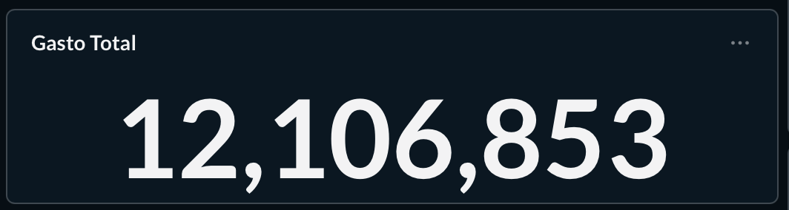
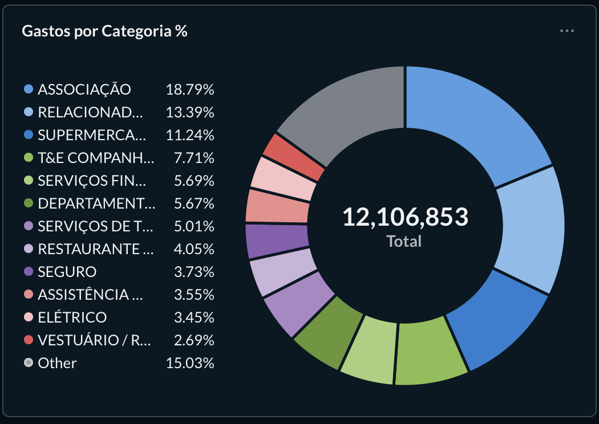
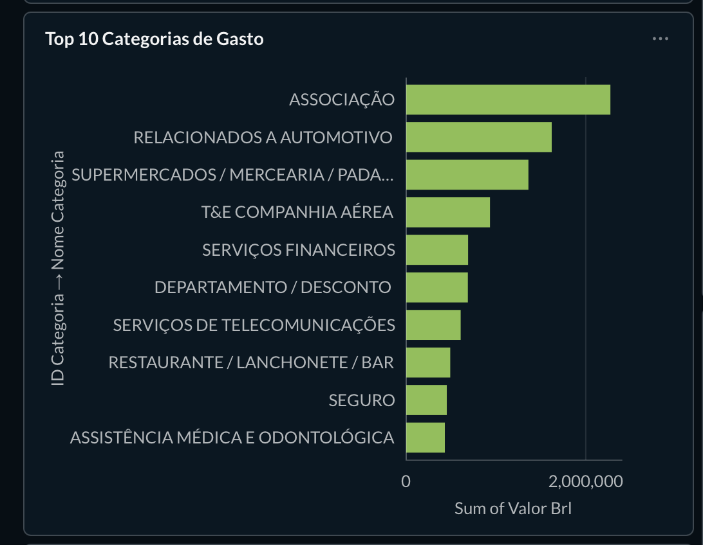
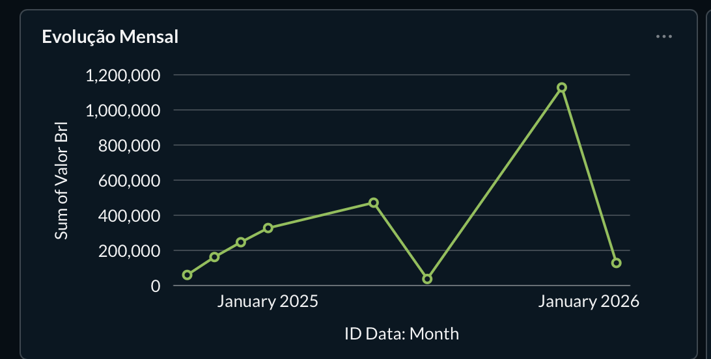
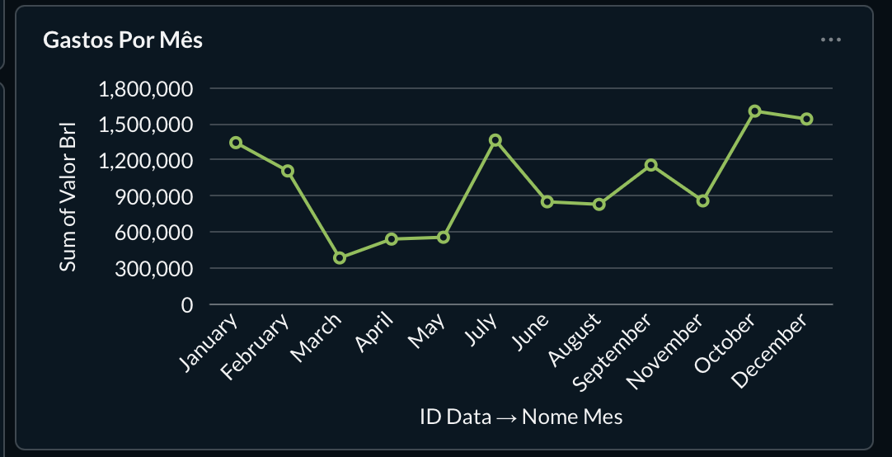
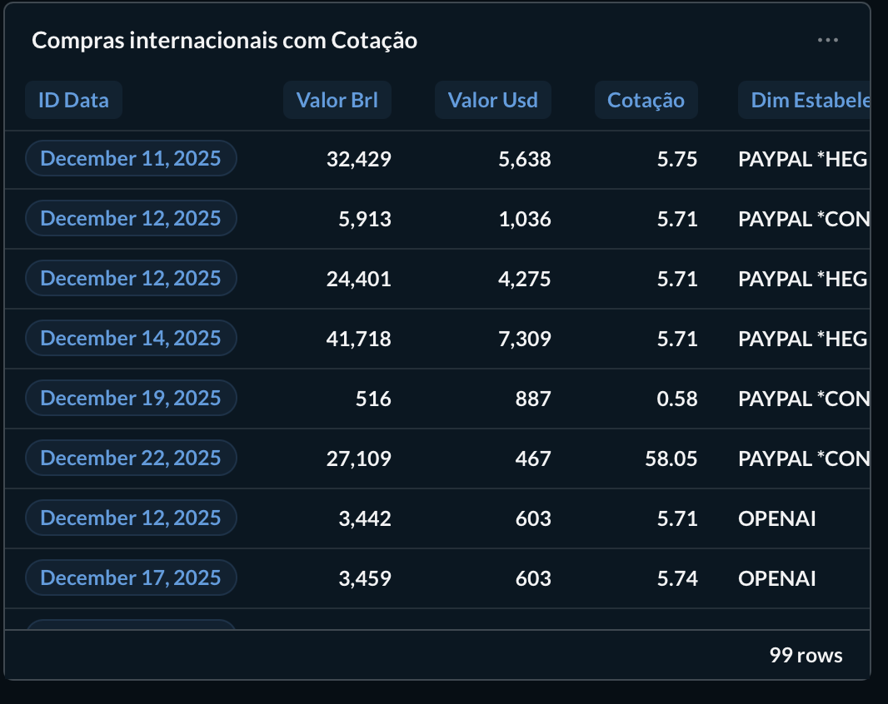
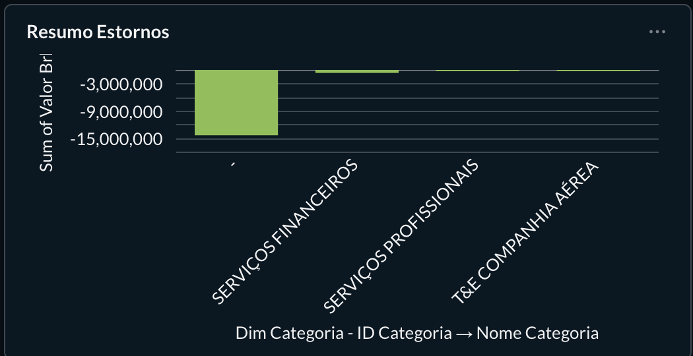
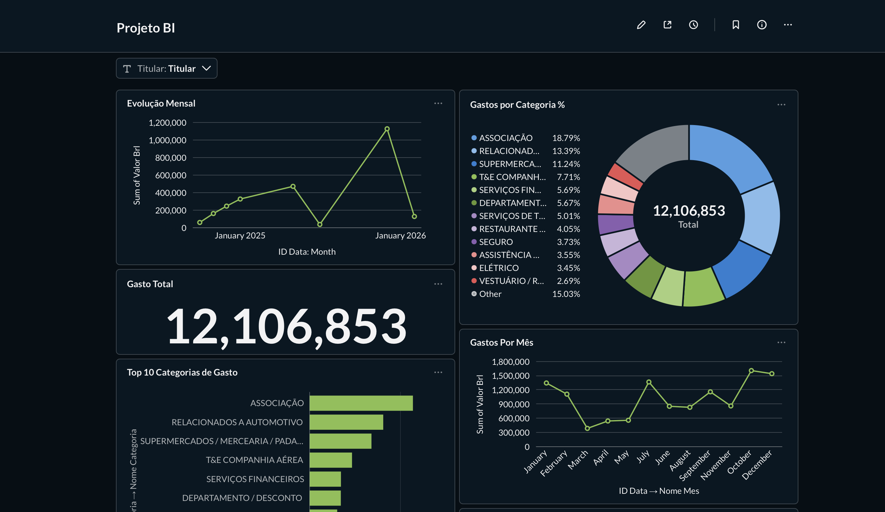
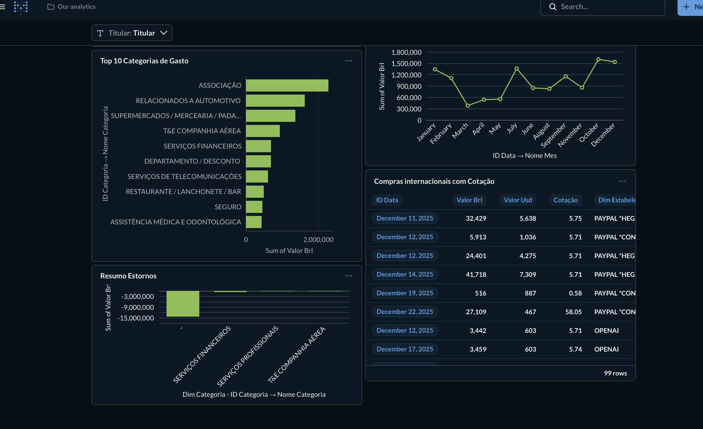

## Gestão de Transações de Cartão de Crédito

Este projeto consiste na implementação de um ecossistema completo de Business Intelligence, desde a ingestão de dados brutos (faturas de cartão) até a visualização analítica. O objetivo é transformar 12 meses de transações dispersas em um Data Warehouse (DW) estruturado sob o modelo dimensional Star Schema.

Período coberto: Março/2025 a Fevereiro/2026

Tecnologias: Python (Pandas/SQLAlchemy), PostgreSQL e Metabase.

## 1. Plano do Projeto e Objetivos
### 1.1. Contexto de Negócio

O projeto simula a necessidade de uma instituição financeira em analisar padrões de gastos, comportamento por titular e categorias de consumo. Os dados originais são extraídos de 12 arquivos CSV (faturas mensais) anonimizados.

### 1.2. Objetivos Técnicos

Modelagem Dimensional: Construção de um Star Schema para otimização de consultas.

Pipeline ETL: Limpeza, padronização e carga automatizada via Python.

Inteligência de Negócio: Desenvolvimento de dashboards para suporte à decisão.

## 2. Arquitetura do Data Warehouse
### 2.1. Modelo Dimensional (Star Schema)

Para garantir performance e clareza, a arquitetura foi dividida em:

Tabela de Fato (fato_transacao): Armazena as métricas (valores em BRL, USD, cotação) e chaves estrangeiras.

Dimensões:

dim_data: Atributos temporais (dia, mês, ano, trimestre, dia da semana).

dim_titular: Nome do titular e final do cartão (cartão lógico).

dim_categoria: Classificação do tipo de gasto (MCC).

dim_estabelecimento: Nomes higienizados (remoção de ruídos de operadoras).

### 2.2. Diagrama Entidade-Relacionamento (DER)
Abaixo, apresenta-se a visualização técnica das tabelas e suas conexões (Chaves Primárias e Estrangeiras) conforme implementado no servidor PostgreSQL:


### 2.3. Vantagens da Arquitetura Adotada
1.  **Redução de Redundância:** Os nomes dos titulares e categorias são armazenados apenas uma vez em suas respectivas dimensões.
2.  **Facilidade de Uso:** Permite que ferramentas de BI criem filtros  de forma nativa e rápida.
3.  **Escalabilidade:** Novos titulares ou novos meses de dados podem ser adicionados sem alterar a estrutura das tabelas existentes.


## 3. Processo de ETL (Extract, Transform, Load) e Resultados

### 3.1. Implementação do Script Python
A automação do fluxo de dados foi desenvolvida em Python, utilizando as bibliotecas Pandas para manipulação e SQLAlchemy para a persistência no banco de dados PostgreSQL. O processo seguiu três etapas:

Extração (Extract): O script utiliza a biblioteca glob para mapear a pasta de faturas e ler automaticamente todos os 12 arquivos CSV, consolidando em um único DataFrame.

Transformação (Transform):

Higienização de Strings: Aplicação de Regex para remover prefixos de adquirentes (ex: PAG*, IFD*, UBER *) dos nomes dos estabelecimentos.

Tratamento de Tipos: Conversão de valores monetários de string para float e tratamento de datas.

Lógica de Parcelas: Divisão da coluna de parcelamento (ex: "2/10") em colunas numéricas de parcela_atual e total_parcelas.

Carga (Load): Utilização da técnica de Upsert. O código verifica se o titular ou a categoria já existem nas tabelas de dimensão antes de inserir, garantindo que não haja duplicidade de registros.

### 3.2. Resultados e Validação (Queries SQL)
Para validar a integridade do Data Warehouse, foram executadas consultas analíticas no pgAdmin 4. Abaixo seguem as evidências do banco de dados populado:

### A) Gasto Total por Titular 

O relacionamento entre a fato_transacao e a dim_titular está funcionando.


### B) Top 5 Categorias de Maior Gasto

Demonstra a classificação correta das despesas processadas pelo ETL.


## 4. Análise de Dados e BI
### 4.1. Perguntas de Negócio Respondidas

Gasto total por titular por mês.


Top 10 categorias de maior impacto financeiro.



Evolução mensal do total gasto (série temporal).



Compras internacionais com cotaçao


Análise de estornos.


### 4.2. Dashboard Analítico (Metabase)

As visualizações foram construídas no Metabase, conectadas diretamente ao DW.





5. Estrutura do Repositório
Plaintext
Projeto_BI/
├── faturas/             # Arquivos CSV originais (Dados Brutos)
├── scripts/             # Pipeline ETL (etl_projeto.py)
├── sql/                 # Scripts de criação e queries analíticas
│   ├── analise_gastos.sql
│   ├── compras_internacionais.sql
│   ├── criacao_banco.sql
│   ├── estornos.sql    
├── requirements.txt     # Dependências do projeto
└── README.md

## 5. Como Executar o Projeto

### 5.1  Configurar o Banco de Dados:
    No PostgreSQL (via pgAdmin ou terminal), crie o banco de dados que receberá o Data Warehouse:
    ```sql
    CREATE DATABASE bi;
    ```

### 5.2  Instalar Dependências:
    Certifique-se de ter o Python instalado e execute o comando para instalar as bibliotecas necessárias:
    ```bash
    pip install -r requirements.txt
    ```

### 5.3 Executar o Pipeline ETL:
    Com os arquivos CSV dentro da pasta `/faturas`, execute o script principal para realizar a extração, limpeza e carga dos dados:
    ```bash
    python etl_projeto.py
    ```

### 5.4 Conectar a Ferramenta de BI:**
    * Abra o **Metabase**.
    * Adicione uma nova base de dados do tipo PostgreSQL.
    * Utilize o nome do banco: `bi`.
    * Crie seus dashboards utilizando as queries salvas na pasta `/sql`.